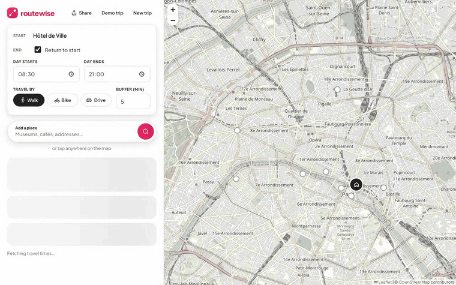
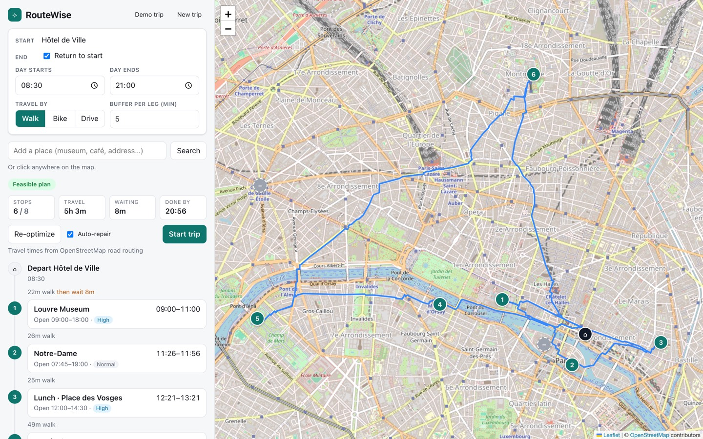
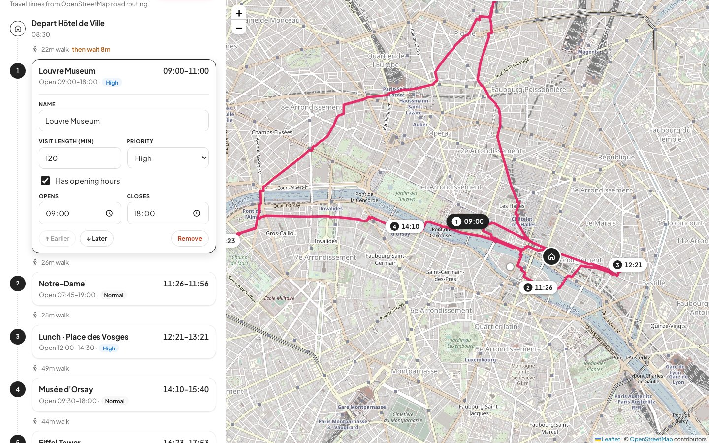
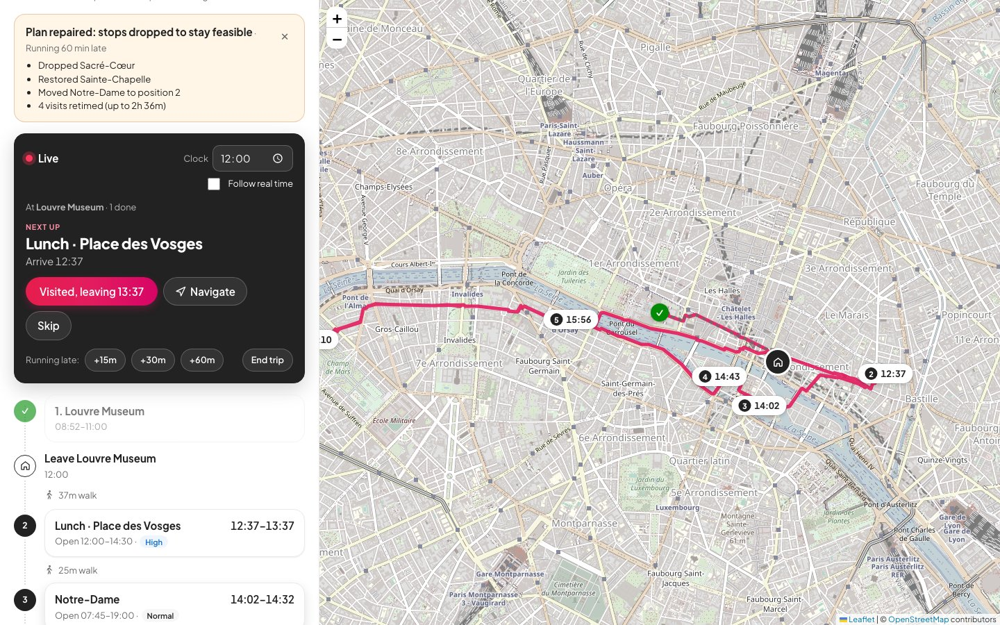

# RouteWise

A smart travel itinerary planner. Give it a starting point and the places you want to visit, with opening hours, visit length and priority. RouteWise finds a feasible order using real road, bike or walking travel times. While you travel, it **automatically repairs the schedule** when things change.



## Screenshots

<p>
  
</p>
<p>
  
  
</p>

## Features

- **Map-based routing.** Travel times come from OpenStreetMap routing (the FOSSGIS OSRM car, bike and foot servers). If the routing service is unreachable, RouteWise estimates times from straight-line distance. Routes are drawn along real roads.
- **Time-window constraints.** Each stop has opening hours, a visit length and a priority (*must visit*, *high*, *normal*, *nice to have*). The day has a start time, an end time and an optional return to the start point. You can add a buffer to every leg.
- **Optimization.** The optimizer first builds an order by cheapest insertion, then improves it with local search (relocate, swap and 2-opt moves). When not everything fits, it drops the lowest-priority stops that make the day work, and never drops *must visit* stops.
- **Automatic schedule repair.** After every change (running late, a changed visit length or opening hours, a new stop, a skipped stop), the plan is repaired with the least disruption it needs. It escalates only as far as necessary:
  1. **Retime**: keep the order and shift the times.
  2. **Reorder**: move stops around until the day is feasible again, stopping at the first feasible order.
  3. **Drop**: leave out the lowest-priority optional stops.

  Dropped stops come back automatically if time frees up. A banner explains each change.
- **Live mode.** "Start trip" steps through the day: mark stops as visited, report delays (+15, +30 or +60 minutes), skip stops or set the clock. Turn on **Follow real time** to have the clock catch up with the wall clock on its own.
- **Place search and map pins.** Search for places with Nominatim, or click the map to drop a pin. Everything is saved in `localStorage`.

## Getting started

```bash
npm install
npm run dev      # http://localhost:5173
npm test         # solver and repair unit tests
npm run build    # type-check and production build
```

No API keys are needed. The app loads a demo walking day in Paris that deliberately doesn't quite fit, so you can see stops being dropped and repaired right away.

## Project layout

```
src/
  core/            pure TypeScript planning engine (no React)
    solver.ts      simulation, cost model, construction, local search, dropping and exchange
    repair.ts      least-disruption repair and change reporting
    problem.ts     turns a trip plus live progress into a solver problem
  services/        OSRM routing and Nominatim geocoding, with fallbacks
  state/           useTripPlanner hook: persistence, auto-repair loop, live-mode actions
  components/      map, itinerary timeline, live panel, repair banner and settings
```

### How the solver scores plans

Each plan is scored by comparing three things in order, so an earlier one always outweighs the later ones:

1. **Violations**: minutes a visit runs past closing time, plus minutes the day runs past its end.
2. **Dropped stops**: the total priority weight of the stops left out (high = 10, normal = 3, nice to have = 1; must-visit stops are never dropped).
3. **Travel time**, plus a small penalty for time spent waiting.

The solver is aimed at single-day trips with up to a few dozen stops. Every candidate move is scored by simulating the whole day again.

## Limitations

- Plans cover one day at a time.
- The public OSRM and Nominatim servers are rate-limited and meant for light use. For production, host your own or use a commercial provider (change `src/services/routing.ts` and `src/services/geocode.ts`).
- Live mode can follow the real clock, but your position isn't tracked by GPS. You mark each stop as visited yourself.
